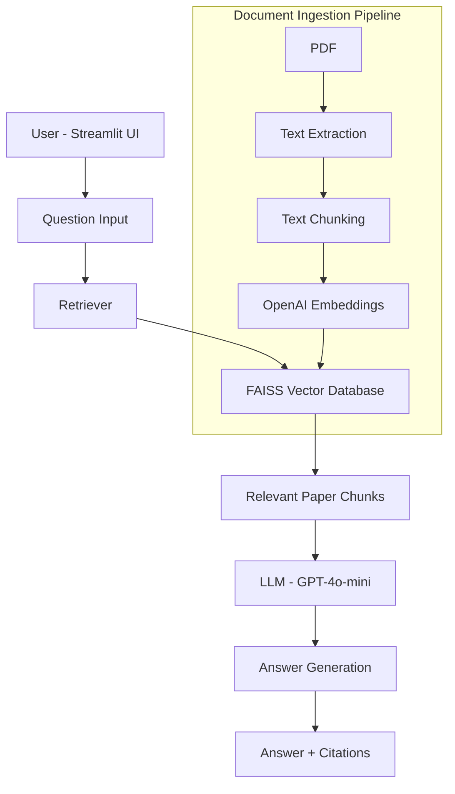

# AI Research Paper Assistant (RAG + LLM)

An AI-powered research assistant that can read research papers and answer questions with citations.

## Features

- Upload research papers
- Ask questions about papers
- Multi-document retrieval
- Paper comparison
- Citation tracking
- Chat-style UI

## Tech Stack

- Python
- LangChain
- OpenAI GPT-4o-mini
- FAISS Vector Database
- Streamlit
- Retrieval-Augmented Generation (RAG)

## Architecture

PDF → Chunking → Embeddings → Vector Database → Retriever → LLM → Answer

